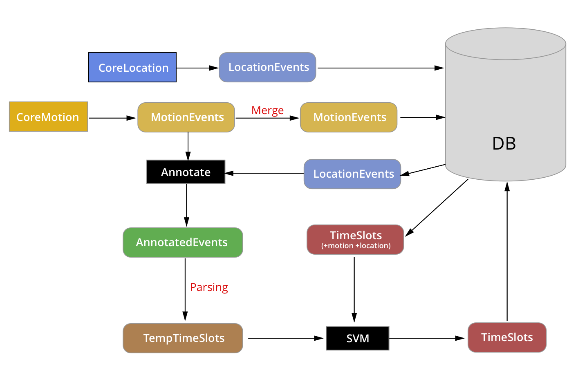

# Smart Guessing System

This document describes how tracking services, persistence and the algorithm work together to provide the smart guessing functionality. The main idea is to automatically gather data from the phone and with it generate a timeline of categories (time slots). The user can then set the correct category for mislabeled time slots and the app will use **machine learning** algorithms to learn from the user selection and generate a better time line next time.

To start with some labeled time slots we'll provide a _standard day_ right of the bat, consisting of labeled time slots we know are more common for every user (sleep for sure and maybe food or work too).

## Tracking

The two sources of information we use currently are the phone **location services** (CoreLocation) and the **motion activity** (CoreMotion). We gather information in the background and then generate the timeline in runtime when the user opens the app.

This process is incremental, every time the user opens the app we'll query motion and location events since the latest timeline generation date and create new time slots. An edge case here is the last time slot generated, which could be extended if necessary.

### CoreLocation

We use Apple's Core Location framework to gather location information. Specifically we use the **significant location changes API** which only emits events when the user's location changed significantly (500m more or less) has low battery impact. Then, and only then, we turn **GPS** on for some seconds to get a more accurate location.

I think the **user should be informed** about this. One of the main concerns with this kind of apps is they usually eat battery life, but we don't, or at least not as much as other apps due to our limited usage of CoreLocation.

But due to the significant location change API being based on the proximity of cell towers a bit of more testing should be done in less populated areas.

Also it might be a good idea to get user's GPS location every time they open the app, just to have more accurate data. This is something we don't do at the moment, but we should explore it.

### CoreMotion

We haven't been able to access CoreMotion information in the background without the use of nasty tricks that kill the phone's battery, like playing a silent audio to keep the app running. This means we can only access the historic motion activity data when the user opens the app.

This on one side is good news for the user, as we won't keep the app running and we won't waste the phone's battery needlessly. But on the other side CoreMotion only gives us access to the **last week of motion activities**, so if the user opens the app with a frequency lower than every week, we will loose some data.

I personally think we can live with that. With the use of notifications we can try bringing the user to the app more frequently.

## Timeline generation

Merging the two sources of information we have, we end up with a stream of motion activity events, each of them annotated with the location in which they took place. This list of events has a high granularity and looks something like this:

```
2017-12-21 07:10:22 still at 40.4134539747987,-3.72705138288785
2017-12-21 07:30:13 still at 40.4134539747987,-3.72705138288785
2017-12-21 08:00:34 walk  at 40.4134539747987,-3.72705138288785
2017-12-21 08:45:03 walk  at 40.4140156074618,-3.72467680871441
```

With that we generate the user's timeline, which can be thought of as a two step process: First we divide the user's day in time slots with a start and an end timestamp. And then we label each of those times slots with our best guess for a category (family, sleep, work, food...)

### Dividing the user's day into time slots

This first step is done just by parsing the mentioned list of annotated events and **merging or deleting** some of those events depending on some arbitrary rules. We loop the event list multiple times each of them making a different parsing pass. The order of passes is important here:

- Merge consecutive events with same category and durations lower than 30 minutes
- Remove still, run and cycling events with duration lower than 3 minutes
- Merge consecutive events with same category and durations lower than 1 hour
- Remove walk events with duration lower than 3 minutes
- Merge consecutive run, cycling and auto events with same category and durations lower than 3 hours
- Remove all events with duration lower than 5 minutes

This results in a more or less accurate timeline where we merge consecutive events unless they are very long (still sleep event, for example) and we remove very short events, while using the short walking events as a way to split activities of the same kind.

Although this has good results most of the time, this is the most arbitrary part of the process and it can probably be improved using some sort of **clustering algorithm**. It's something we should look into in the future.

### Guessing the categories

After the previous step we end up with a timeline divided in time slots in which we believe the user was doing different specific activities, but we don't know which activities yet. Although we could make some guesses looking at the motion events (if it's auto we guess commute, for example), it's probably a better solution to let the machine learning algorithm do most or all of the work (a commute by car may be categorize as work for the user, for example)

To guess the category for every time slot we will use a machine learning algorithm called **Support Vector Machine**. We first train the algorithm with a list of previously categorized events and then the algorithm can guess the category of new events.

For each slot we feed to the algorithm: the start time, the duration, the day of the week, the latitude and longitude and the top motion activity event in that timeframe.

For the training phase we use first the _standard day_ we hard coded into the app and then whichever time slots the user categorized hims self or voted as correct using the rating system in the app. Depending on the amount of data we might consider using also non voted and non rated slots.

For the guessing phase we input the result of the previous step, the time slots without categories.

The result is a category for each time slot but also a probability confidence, which we use to discard categories with a confidence lower than 50% (number subject to experimentation) and set those slots as `unknown`. Then the user can choose a correct category for those and other slots, and we have more info for the algorithm to improve.

## User feedback & Privacy

Until now the user is sending his log file with the feedback email, this includes location information. I propose making this opt-in and informing the user about it. This way we can also select some fields from the DB together with the logs, to make that information more useful.

It might be interesting letting the user know his location won't leave the device unless he intentionally share's it with us for debugging. And even so we could offset it randomly (only when sharing it) so it would be completely private.

# Technical details

## Persistence



In order for smart guessing to work we need to persist some data. As time events all come one after another, we will not store end times for any of them, this makes handling them much easier, and still if end time is needed for some operations or for display, it's easily calculated on the fly.

### Location Events

Location updates, as already described, happen in background and need to be persisted as they come in order to be processed later when the user opens the app.

The current implementation of the Location Service needs to be streamlined to send only the most accurate location for every significant location change.

For every location event we need to store **latitude, longitude and timestamp**. Storing the rest of the information like altitude, accuracy, speed... it's probably a good idea, but we are not making a use of it right now.

### Annotated Motion Events

When the user opens the app we get all CoreMotion activity events since the last time he opened it (a week tops). As this data has very heigh granularity we first make a first parsing pass to get rid of unknown motion activity events.

At this point the work flow splits in two paths. First we get those motion events and merge them as much as we can to store them in the DB. Then with those same un-merged events we merge them with the location events in that timeframe. Which leaves us with a series of motion activity events each of them with a timestamp and a location.

We parse that date to generate the time slots as described previously.

### Time slots

For the actual representation of time slots in the app, a lot of information can be inferred from the motion and location events stored in the data base, so for time slots we only need to store: start time, category and whether the time slot was edited (category or start time).

Again we don't store end times as it makes many operations easier. We also won't be breaking slots at midnight in the DB, as that would break the smart guessing algorithm. We can, however, add and modify all that data when retrieving them from DB to use in the app.

### DataTypes

These are the needed data types, then ones called `[Whatever]Entity` are meant to be DB representations of the data and will be transformed to other types when fetched.

**Location**: latitude, longitude, altitude, accuracy
**LocationEventEntity**: timestamp, location
**MotionEvent**: startTime, endTime, motionType
**MotionEventEntity**: timestamp, motionType
**AnnotatedEvent**: startTime, endTime, location, motionType
**TempTimeSlot**: startTime, endTime, [AnnotatedEvent]
**TimeSlot**: startTime, endTime, category, [AnnotatedEvent]
**TimeSlotEntity**: timestamp, category, edited

### DB optimization

With this design for the DB we will be storing all locations, all core motion events and all time slots. It probably makes sense to purge old data storing a summary of locations and motion events in the time slot table itself. We leave this possibility open for a future implementation.

## Machine Learning Algorithm

Information about this classification algorithm can be found every where in Internet. For example [here](https://www.analyticsvidhya.com/blog/2014/10/support-vector-machine-simplified/). While there are many implementations I couldn't find one in Swift that got the results we needed, so we are using [LIBSVM](https://www.csie.ntu.edu.tw/~cjlin/libsvm/), which is a C++ implementation.

We use that code through a Objective-C++ wrapper.

## Future improvements

There are many points open for improvement:
- The way we generate the time slots (without categories) is completely arbitrary, we should think about using some clustering algorithm for this.
- Although SVM seems to fit our needs, we might consider changing it in the future if we find something better (neural networks, maybe?)
- The data we collect and use to train the SVM model might not be optimal, we should consider changing it or maybe collection more.
